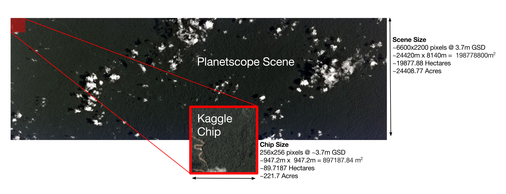
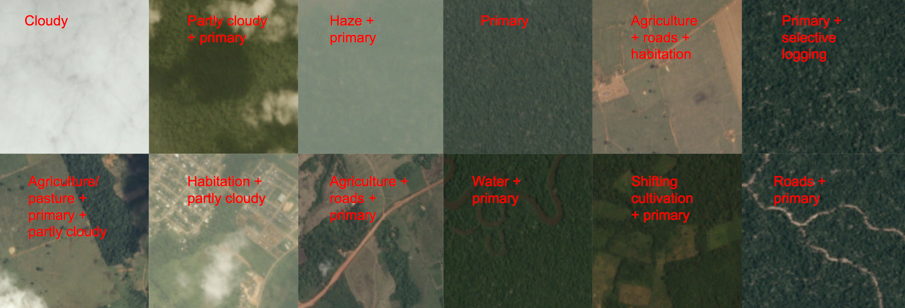
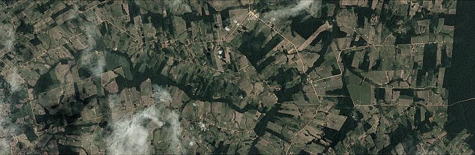
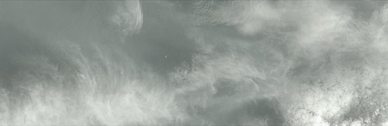
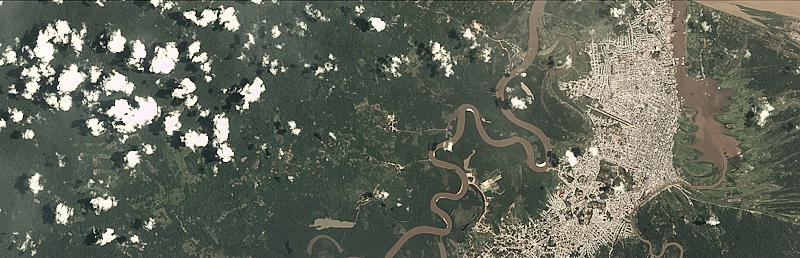
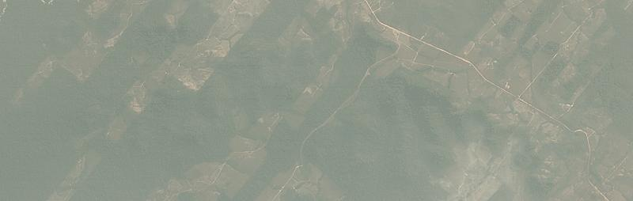
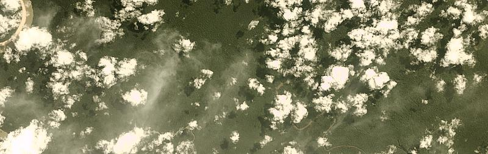
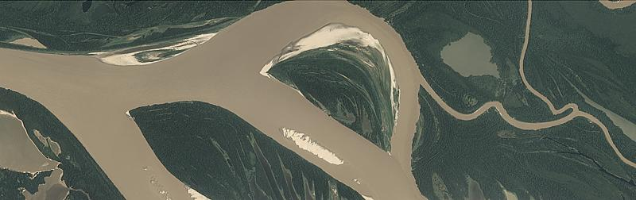
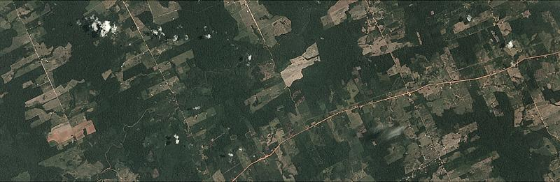

# Amazon Forest Computer Vision
Satellite Image tagging code using PyTorch / Keras

Here is a sample of images we had to work with

_Source: https://www.kaggle.com/c/planet-understanding-the-amazon-from-space/data_

> Note: the repo was developed in May 2017 on PyTorch 0.1. PyTorch was publicly announced in January 2017 and has seen tremendous changes since then.

You will find:
  - [A script that output the mean and stddev of your image if you want to train from scratch](https://github.com/mratsim/Amazon_Forest_Computer_Vision/blob/master/compute-mean-std.py#L28)

  - [Using weighted loss function](https://github.com/mratsim/Amazon_Forest_Computer_Vision/blob/master/main_pytorch.py#L61)

  - [Logging your experiment](https://github.com/mratsim/Amazon_Forest_Computer_Vision/blob/master/main_pytorch.py#L89)

  - [Composing data augmentations](https://github.com/mratsim/Amazon_Forest_Computer_Vision/blob/master/main_pytorch.py#L103), also [here](https://github.com/mratsim/Amazon_Forest_Computer_Vision/blob/master/src/p_data_augmentation.py#L181).
Note use [Pillow-SIMD](https://python-pillow.org/pillow-perf/) instead of PIL/Pillow. It is even faster than OpenCV

  - [Loading from a CSV that contains image path - 61 lines yeah](https://github.com/mratsim/Amazon_Forest_Computer_Vision/blob/master/src/p2_dataload.py#L23)

  - [Equivalent in Keras - 216 lines ugh](https://github.com/mratsim/Amazon_Forest_Computer_Vision/blob/master/src/k_dataloader.py). Note: so much lines were needed because by default in Keras you either have the data augmentation with ImageDataGenerator or lazy loading of images with "flow_from_directory" and there is no flow_from_csv

  - [Model finetuning with custom PyCaffe weights](https://github.com/mratsim/Amazon_Forest_Computer_Vision/blob/master/src/p_neuro.py#L139)

  - Train_test_split, [PyTorch version](https://github.com/mratsim/Amazon_Forest_Computer_Vision/blob/master/src/p_model_selection.py#L4) and [Keras version](https://github.com/mratsim/Amazon_Forest_Computer_Vision/blob/master/src/k_model_selection.py#L4)

- [Weighted sampling training so that the model view rare cases more often](https://github.com/mratsim/Amazon_Forest_Computer_Vision/blob/master/main_pytorch.py#L131-L140)

 - [Custom Sampler creation, example for the balanced sampler](https://github.com/mratsim/Amazon_Forest_Computer_Vision/blob/master/src/p_sampler.py)

 - [Saving snapshots each epoch](https://github.com/mratsim/Amazon_Forest_Computer_Vision/blob/master/main_pytorch.py#L171)

 - [Loading the best snapshot for prediction](https://github.com/mratsim/Amazon_Forest_Computer_Vision/blob/master/pytorch_predict_only.py#L83)

 - [Failed word embeddings experiments](https://github.com/mratsim/Amazon_Forest_Computer_Vision/blob/master/Embedding-RNN-Autoencoder.ipynb) to [combine image and text data](https://github.com/mratsim/Amazon_Forest_Computer_Vision/blob/master/Dual_Feed_Image_Label.ipynb)

 - [Combined weighted loss function (softmax for unique weather tags, BCE for multilabel tags)](https://github.com/mratsim/Amazon_Forest_Computer_Vision/blob/master/src/p2_loss.py#L36)

 - [Selecting the best F2-threshold](https://github.com/mratsim/Amazon_Forest_Computer_Vision/blob/master/src/p2_metrics.py#L38) via stochastic search at the end of each epoch to [maximize validation score](https://github.com/mratsim/Amazon_Forest_Computer_Vision/blob/526128239a6abcbb32fbf5b34ed8cc7a3cd87c4e/src/p2_validation.py#L49). This is then saved along model parameter.

  - [CNN-RNN combination (work in progress)](https://github.com/mratsim/Amazon_Forest_Computer_Vision/blob/master/src/p3_neuroRNN.py#L10)
